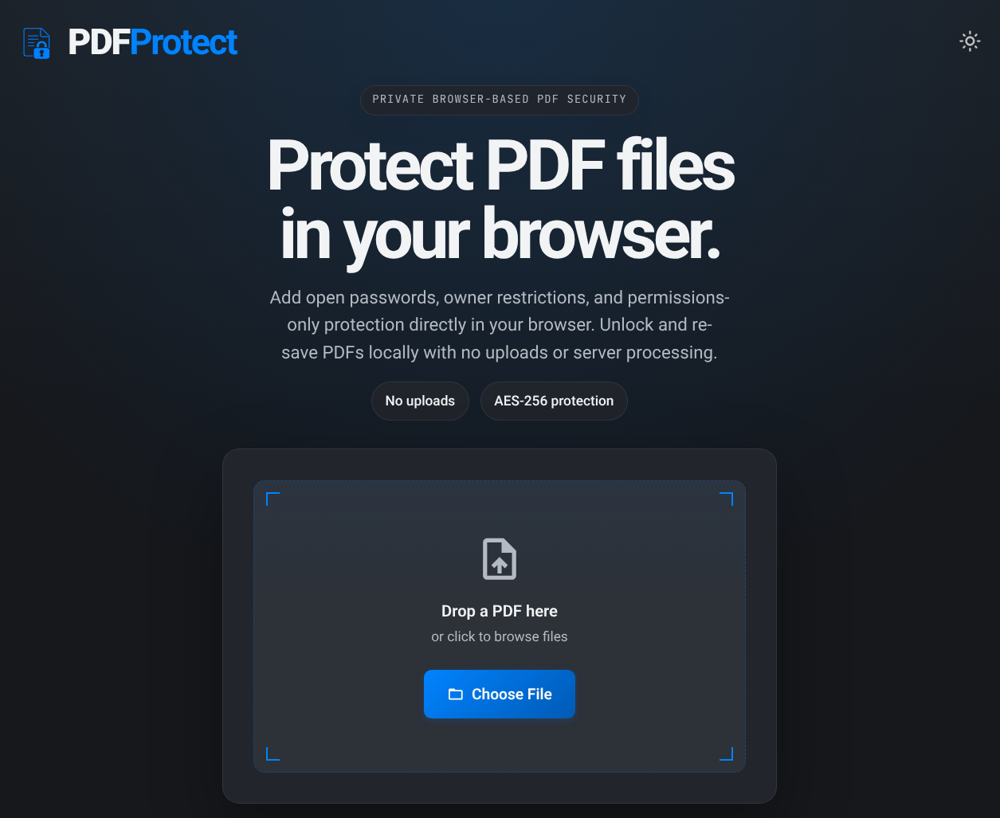

# PDF Protect

PDF Protect is a free, privacy-first web app for adding, updating, and removing password protection from PDF documents. All processing runs entirely in your browser: nothing is uploaded to any server.

Live at [pdfprotect.me](https://pdfprotect.me)

## Key Features

### Core Functionality

- **PDF Protection**: Apply password-based protection to unprotected or already-opened PDF documents
- **PDF Unlocking**: Open password-protected PDFs in the browser when the correct password is provided
- **Protection Removal**: Remove password protection and download an unencrypted copy when owner-level access is available
- **Privacy-First**: No server uploads, no accounts, and no background processing outside the browser

### Security and Permission Controls

- **User Password**: Require a password to open the protected document
- **Owner Password**: Optionally require a separate owner password for changing permissions or removing protection
- **Permissions-Only Protection**: Leave the user password blank and use only an owner password to apply viewer-managed restrictions without an open-password prompt
- **Shared-Password Fallback**: If the owner password is left blank, PDF Protect reuses the user password so the file does not end up with an undisclosed random owner password
- **Permission Toggles**: Control printing, copying, modification, annotation, form filling, and document assembly
- **Password Strength Feedback**: Entropy-based password strength indicator plus confirmation checks for user and owner passwords
- **Common Password Warning**: When setting a new password, the app checks it against a bundled list of 10,000 commonly-known passwords and shows an inline advisory if a match is found - no data leaves the browser
- **Owner-Password Removal Safeguard**: Prevents user-level sessions from removing protection when owner credentials are required

### Password Recovery Scanning

- **Dictionary Scan**: When a password-protected PDF is loaded, a common-password scan starts automatically in the browser; no data is sent anywhere
- **Bundled Word Lists**: Two locally-stored password lists from the [SecLists](https://github.com/danielmiessler/SecLists) project are included: a 10,000-entry quick scan (default) and a 100,000-entry thorough scan
- **List Toggle**: Switch between the 10k and 100k lists with a single click; the scan restarts immediately with the new list
- **Auto-Fill**: If the password is found it is automatically filled into the unlock field; just click Unlock to continue
- **Cancellable**: A cancel button stops the scan at any time, and manual entry is always available regardless of scan state
- **Non-Blocking**: Scans yield to the browser every 150 passwords so the UI stays fully responsive during long scans

### Interface and Workflow

- **Single-Page Workflow**: Load, unlock, protect, and re-save documents from one browser-based interface
- **Drag-and-Drop File Loading**: Drop a PDF directly onto the page or browse manually
- **Locked-State Detection**: Detects whether a PDF is encrypted and switches into the unlock flow automatically
- **Dark and Light Mode**: Persisted theme preference across sessions

## Browser Compatibility

- **Optimal**: Google Chrome and other current Chromium-based browsers
- **Good**: Firefox, Safari, and Microsoft Edge (latest versions)
- **Requirement**: A modern browser with ES module, File API, and Web Crypto support

## Known Limitations

PDF Protect runs client-side, so performance depends on the browser, device, and PDF size. Files are capped at 50 MB. Very large or complex PDFs may take longer to load, unlock, or save. New protected output is currently limited to AES-256 by the bundled PDF engine. PDF permissions are best-effort viewer restrictions; some viewers may still allow actions such as text selection or copying. Certificate-based encryption is not supported.

## Technical Notes

- **Architecture**: Static single-page app with vanilla JavaScript ES modules: no build step, no framework, no server
- **PDF Engine**: `js/vendor/libpdf-core.js` provides PDF loading, authentication, protection, and save operations
- **State Handling**: `js/app.js` manages the UI state machine and form validation; `js/pdf-session.js` isolates PDF authentication and protection logic
- **Font Handling**: UI fonts (Roboto, JetBrains Mono, Material Icons Outlined) are self-hosted in `fonts/`: no external CDN requests
- **Security**: Content Security Policy enforces `default-src 'self'`: no external requests permitted
- **Tests**: Focused Node-based regression tests covering file validation, theme selection, password confirmation, password strength, state transitions, permissions disclosure, and owner-password-based protection removal

## Credits and Third-Party Licensing

- **[libpdf-core](https://github.com/libpdf-js/core)** powers PDF encryption, authentication, and protection changes; bundled third-party licence notices are included directly in `js/vendor/libpdf-core.js`
- **[SecLists](https://github.com/danielmiessler/SecLists)** by Daniel Miessler et al.: the `passwords/10k-most-common.txt` and `passwords/100k-most-used.txt` word lists are sourced from this project | [MIT License](https://github.com/danielmiessler/SecLists/blob/master/LICENSE)
- **Roboto Font** by Christian Robertson | [Apache License 2.0](https://www.apache.org/licenses/LICENSE-2.0)
- **JetBrains Mono** by JetBrains | [SIL Open Font License 1.1](https://openfontlicense.org/)
- **Material Icons** by Google | [Apache License 2.0](https://www.apache.org/licenses/LICENSE-2.0)
